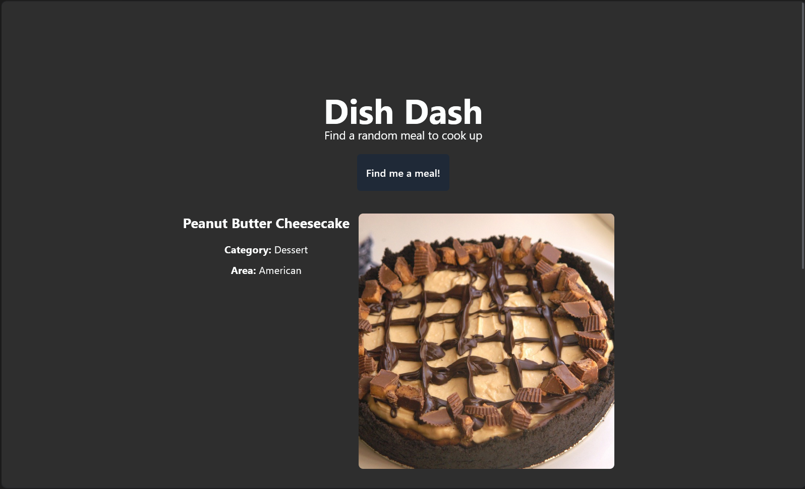

# DishDash
## What is this?
Dish Dash is a basic app made to find you a random meal to make when you have no idea, you can access it [here](https://dish-dash-jade.vercel.app/)

## Features:
- Large variatey of foods and deserts using [the meal db](https://www.themealdb.com) API
- Infinite generations and free to use
- Image to visualise the food you are making 
- Ingredients with measurements
- Clear instructions

## How to self host: 
The easiest way to do this is with [vercel](https://vercel.com/) (recomended for begginers) which will walk you through the build process

- To build the project run `npm run build`
- Project can be tested wiith `npm run dev`

## Technologies:
- Project is built using a js framework named [sveltekit](https://svelte.dev/)
- API used for the food api is [the meal db](https://www.themealdb.com)
- For styling [tailwindcss](https://tailwindcss.com/) was used
- Uses the ui library [daisyUI](https://daisyui.com/) for the button

Made by cloudy